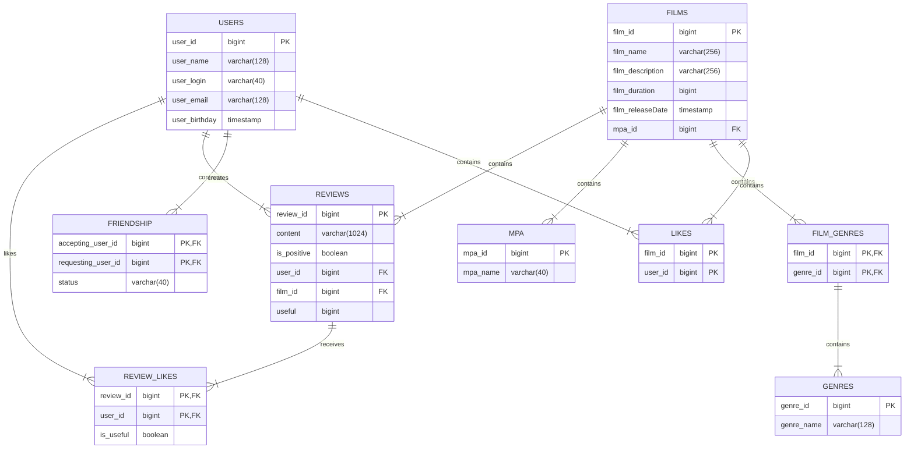

# java-filmorate
Template repository for Filmorate project.
В рамках группового проекта были реализованы следующие фичи: 
- 1 Функциональность «Отзывы»
- 2 Функциональность «Поиск»
- 3 Функциональность «Общие фильмы»
- 4 Функциональность «Рекомендации»
- 5 Функциональность «Лента событий»
- 6 Функциональность «Удаление фильмов и пользователей»
- 7 Функциональность «Добавление режиссеров в фильмы»
- 8 Функциональность «Вывод самых популярных фильмов по жанру и годам»

